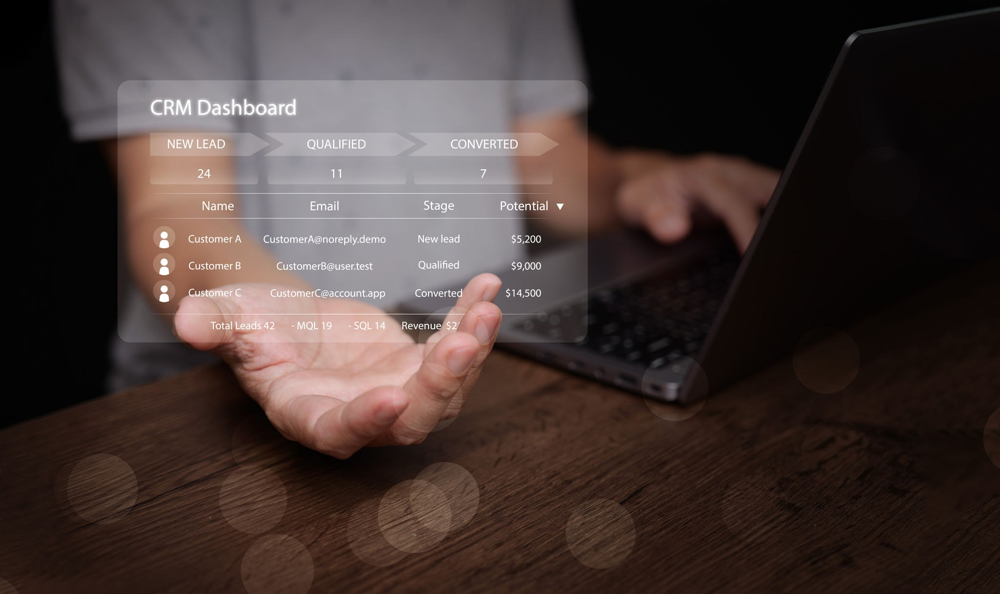

Aqui está a estrutura de pesquisa pronta para o seu trabalho, formulada com rigor acadêmico, citações de autores de referência e sugestões visuais que você já pode incluir no documento.

## O que é o Customer Relationship Management (CRM)?
Embora o termo **Customer Relationship Management (CRM)** — ou Gestão de Relacionamento com o Cliente — seja frequentemente confundido apenas com ferramentas de software, a literatura acadêmica o define fundamentalmente como uma **estratégia de negócio**.

Segundo os autores Don Peppers e Martha Rogers, pioneiros no estudo do tema, o CRM é uma abordagem estratégica e abrangente que visa compreender e influenciar o comportamento do cliente por meio de interações e análises significativas. O objetivo é melhorar a aquisição de clientes, maximizar a retenção e aumentar a lucratividade organizacional.

Na visão de Philip Kotler, o "pai do marketing", o CRM foca no desenvolvimento de programas voltados a atender às necessidades individuais de clientes valiosos, maximizando o que ele chama de **Customer Lifetime Value (CLV)** — o valor total que um cliente gera para a empresa ao longo de toda a sua "vida" de consumo.

Em resumo, o CRM é a integração de estratégias de marketing, processos de vendas e infraestrutura tecnológica para construir relacionamentos de longo prazo e mutuamente benéficos.

## O Papel do CRM nas Organizações
O papel central do CRM é instituir uma cultura *customer-centric* (centrada no cliente), quebrando os "silos" de informação dentro das empresas. Ele atua conectando diferentes departamentos para garantir uma experiência de consumo fluida e contínua.

A academia geralmente classifica o papel do CRM em três vertentes principais:

1. **CRM Operacional:** Focado na automação e otimização dos processos de linha de frente, ou seja, onde há contato direto com o cliente (marketing, vendas e suporte). Ele garante que todo o histórico de interações (ligações, e-mails, compras) seja registrado em um único local.
2. **CRM Analítico:** É o processamento de dados (*Data Mining*). Seu papel é cruzar as grandes quantidades de dados geradas pelo CRM Operacional para identificar padrões de consumo, prever tendências, segmentar públicos e apoiar a tomada de decisão estratégica.
3. **CRM Colaborativo:** Seu papel é garantir a distribuição da informação. Ele assegura que fornecedores, parceiros e diferentes departamentos internos (como o marketing e a logística) tenham a mesma "visão 360 graus" do cliente para alinhar o atendimento.

## Exemplos Práticos e Casos de Uso
O CRM se manifesta tanto em rotinas corporativas quanto nas plataformas tecnológicas que suportam essas ações.

- **Exemplos de Softwares de Mercado:** Plataformas corporativas como **Salesforce**, **HubSpot**, **Microsoft Dynamics** e **SAP CRM** são os sistemas que materializam essa estratégia nas empresas modernas.
- **Exemplo Prático (Automação e Vendas):** Um cliente abandona um carrinho de compras em um site. O CRM registra esse comportamento (Operacional) e, no dia seguinte, dispara automaticamente um e-mail personalizado com um cupom de desconto focado no item abandonado. Posteriormente, ele analisa se a estratégia gerou lucro (Analítico).
- **Exemplo Prático (Programas de Fidelidade):** Companhias aéreas utilizam o CRM para rastrear a frequência de voos, os assentos preferidos e as rotas de um passageiro. Com isso, conseguem oferecer upgrades automáticos para clientes da categoria *Premium* e antecipar soluções caso o voo desse cliente específico atrase.
Para ilustrar a aplicação prática em seu trabalho, recomendo incluir uma imagem de como os dados são visualizados no dia a dia pelos gestores:

> **Dica para o seu documento:** Use a primeira imagem na introdução do seu trabalho para ilustrar a teoria e deixe esta segunda imagem para a seção de "Exemplos" ou "Implementação", mostrando como a teoria vira prática no monitoramento de métricas.

## Fontes e Referências Bibliográficas
Aqui estão as referências de peso acadêmico, formatadas no padrão que você pode colar diretamente na bibliografia do seu trabalho (baseado no padrão ABNT):

- **KOTLER, P.; KELLER, K. L.** *Administração de Marketing*. 14. ed. São Paulo: Pearson Education do Brasil, 2012. *(Ótimo para referenciar a parte de satisfação do cliente e Customer Lifetime Value)*.
- **PAYNE, A.; FROW, P.** A Strategic Framework for Customer Relationship Management. *Journal of Marketing*, v. 69, n. 4, p. 167-176, 2005. *(Artigo seminal para embasar a divisão do CRM em estratégico, operacional e analítico)*.
- **PEPPERS, D.; ROGERS, M.** *Managing Customer Relationships: A Strategic Framework*. 2. ed. Hoboken: John Wiley & Sons, 2011. *(Livro base para explicar o CRM como estratégia de negócio e não apenas como ferramenta)*.
